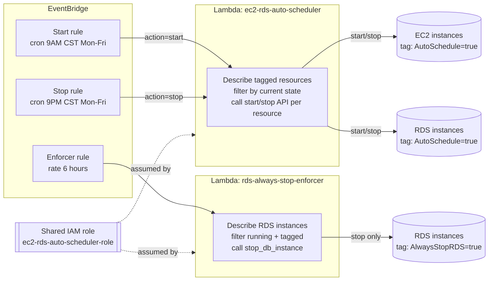

# aws-rds-scheduler

Tag-based start/stop scheduling for EC2 and RDS, plus a second Lambda that
deals with a specific RDS annoyance: AWS auto-restarts a stopped DB instance
after 7 days whether you want it running or not. Both are deployed with plain
bash and the AWS CLI, no CloudFormation, Terraform, or SAM involved. I built
this for a handful of dev/test accounts where nobody needed EC2 or RDS running
outside business hours, and where re-tagging a resource is a lot less friction
than maintaining a Terraform module for two Lambdas.

## How it works

There are two independent pieces:

**1. `ec2-rds-auto-scheduler`** - one Lambda, two EventBridge cron rules. The
start rule fires at 9 AM CST Monday-Friday, the stop rule fires at 9 PM CST
Monday-Friday. Each rule invokes the same Lambda with a different payload
(`{"action": "start"}` or `{"action": "stop"}`). On invocation, the Lambda
describes EC2 instances and RDS instances tagged `AutoSchedule=true`, filters
down to whichever ones are actually in a state where the action makes sense
(only start what's stopped, only stop what's running), and calls
`start_instances`/`stop_instances` or `start_db_instance`/`stop_db_instance`
per resource. Nothing is hardcoded to an instance ID - add or remove the tag
and the next scheduled run picks it up.

**2. `rds-always-stop-enforcer`** - a separate Lambda on a `rate(6 hours)`
EventBridge rule, running every 6 hours, every day, with no schedule window.
Its only job is finding RDS instances tagged `AlwaysStopRDS=true` that are
`available` (running) and stopping them. This exists because AWS force-starts
a stopped RDS instance after 7 days of being stopped, and there's no setting
to turn that off. For databases where the requirement is "keep the data,
never let it run," a scheduler that only fires twice a day isn't enough - the
7-day auto-restart can happen at any time, so this checks frequently and
reacts.

## Architecture



Both Lambdas run under the same IAM role (`ec2-rds-auto-scheduler-role`),
created once by `deploy.sh` and reused by `deploy-rds-enforcer.sh`. That role
grants `ec2:Describe/Start/StopInstances` and
`rds:DescribeDBInstances`/`ListTagsForResource`/`Start/StopDBInstance` on
`Resource: "*"` - IAM doesn't let you scope those actions to "only resources
with tag X" cleanly, so the safety boundary here is the tag check inside the
Lambda code, not IAM. That's a real tradeoff: it keeps the policy small and
avoids maintaining per-resource ARNs, but it means the blast radius of a bug
in the Lambda is "anything in the account," not "anything tagged." Given
these are dev/test accounts and the code paths are short and easy to read,
I decided that was an acceptable risk versus the complexity of scoping IAM by
tag with condition keys.

The schedule itself is a fixed UTC-6 offset baked into the cron expressions
in `deploy.sh`, not an actual CST/CDT-aware timezone. That was a deliberate
simplification - EventBridge cron doesn't understand timezones, and pulling
in a timezone-aware trigger (e.g. computing offsets in the Lambda instead of
in the cron expression) felt like more machinery than a "turn things off
outside office hours" script needs. The cost is that someone has to remember
to shift the cron by an hour twice a year for daylight saving, which is
called out in the Troubleshooting section below.

## Deploy

Both scripts are meant to run from AWS CloudShell, where credentials are
already configured. They also work locally against a named profile.

```bash
# 1. Deploy the scheduler first - creates the shared IAM role
bash deploy.sh

# 2. Deploy the enforcer (requires the role from step 1 to already exist)
bash deploy-rds-enforcer.sh

# Local run against a specific profile instead of CloudShell defaults:
AWS_PROFILE=your-profile bash deploy.sh
AWS_PROFILE=your-profile bash deploy-rds-enforcer.sh
```

Both scripts are idempotent - re-running `deploy.sh` updates the Lambda code
and leaves the IAM role and EventBridge rules alone if they already exist.

`deploy.sh` creates:
- IAM role `ec2-rds-auto-scheduler-role` with an inline policy
- Lambda function `ec2-rds-auto-scheduler` (Python 3.12)
- EventBridge rules `ec2-rds-auto-scheduler-start` and `ec2-rds-auto-scheduler-stop`

`deploy-rds-enforcer.sh` creates:
- Lambda function `rds-always-stop-enforcer` (Python 3.12), reusing the role above
- EventBridge rule `rds-always-stop-enforcer-rule`

### Tag your resources

| Tag | Value | Applies to | Effect |
|-----|-------|------------|--------|
| `AutoSchedule` | `true` | EC2, RDS | Start 9 AM / stop 9 PM CST, Mon-Fri |
| `AlwaysStopRDS` | `true` | RDS only | Re-stopped every 6 hours if AWS brings it back up |

```bash
aws ec2 create-tags --resources i-0123456789abcdef0 \
    --tags Key=AutoSchedule,Value=true

aws rds add-tags-to-resource \
    --resource-name arn:aws:rds:us-east-1:123456789012:db:my-database \
    --tags Key=AutoSchedule,Value=true
```

Tags are case-sensitive. Both tags can be set on the same RDS instance -
`AutoSchedule` handles the daily business-hours window, `AlwaysStopRDS`
handles the case where you never want it running at all.

### Teardown

```bash
bash teardown-rds-enforcer.sh   # remove the enforcer first
bash teardown.sh                # remove the scheduler and the shared IAM role
```

Order matters: the enforcer's IAM role is the scheduler's role, so tearing
down the scheduler first would leave the enforcer's Lambda without a valid
role reference on its next update.

## Configuration

Everything configurable lives as variables at the top of `deploy.sh` and
`deploy-rds-enforcer.sh` - there's no parameter store, config file, or CLI
flags:

| Variable | Default | Where |
|----------|---------|-------|
| `REGION` | `us-east-1` (or `$AWS_DEFAULT_REGION`) | both deploy scripts |
| `FUNCTION_NAME` | `ec2-rds-auto-scheduler` / `rds-always-stop-enforcer` | both deploy scripts |
| `ROLE_NAME` | `ec2-rds-auto-scheduler-role` | `deploy.sh` |
| `START_CRON` | `cron(0 15 ? * MON-FRI *)` (9 AM CST) | `deploy.sh` |
| `STOP_CRON` | `cron(0 3 ? * TUE-SAT *)` (9 PM CST) | `deploy.sh` |
| `SCHEDULE` | `rate(6 hours)` | `deploy-rds-enforcer.sh` |

Note the stop rule's UTC day is `TUE-SAT`, not `MON-FRI` - 9 PM CST on a
Monday is already 3 AM UTC Tuesday. If you change the schedule, remember the
UTC day rolls over with it.

## Supported resources

| Service | Supported | Notes |
|---------|-----------|-------|
| EC2 | Yes | Standard instances, not Spot |
| RDS | Yes | Standard DB instances |
| Aurora | No | Aurora clusters use `start-db-cluster`/`stop-db-cluster`, a different API this code doesn't call |

## Project structure

```
aws-rds-scheduler/
├── deploy.sh                  # Scheduler: creates IAM role, Lambda, EventBridge rules
├── teardown.sh                # Scheduler: removes everything deploy.sh created
├── lambda_function/
│   └── index.py               # Scheduler Lambda handler (Python 3.12)
├── deploy-rds-enforcer.sh     # Enforcer: creates Lambda + rule, reuses the scheduler's IAM role
├── teardown-rds-enforcer.sh   # Enforcer: removes the enforcer Lambda + rule only
├── rds_enforcer/
│   └── index.py               # Enforcer Lambda handler (Python 3.12)
├── README.md
└── .gitignore
```

## Troubleshooting

- **Lambda not triggering** - check the EventBridge rules are `ENABLED` in the console.
- **Instances not starting/stopping** - confirm the `AutoSchedule=true` tag is set exactly (case-sensitive), and check CloudWatch Logs for `ec2-rds-auto-scheduler`.
- **RDS keeps restarting on its own** - that's the AWS 7-day auto-restart. Deploy the enforcer and tag the instance `AlwaysStopRDS=true`.
- **Enforcer not stopping RDS** - check CloudWatch Logs for `rds-always-stop-enforcer`, and confirm the tag key/value match exactly.
- **Permission errors** - re-run `deploy.sh`, it reapplies the inline policy on the shared role.
- **Wrong local time** - the cron expressions are a fixed UTC-6 (CST) offset, not DST-aware. During CDT (roughly March-November), shift both crons by one hour: start `cron(0 14 ? * MON-FRI *)`, stop `cron(0 2 ? * TUE-SAT *)`.

## Known gaps

- No tests. There's no unit test suite and nothing runs in CI on this repo - the Lambdas have only been validated by deploying and watching CloudWatch Logs.
- No failure notifications. Both Lambdas log per-resource success/failure to CloudWatch, but nothing pages or emails anyone if a stop/start call fails - you have to go looking in the logs.
- No retry logic. If `start_db_instance` or `stop_db_instance` throws (e.g. the instance is mid-transition), the error is logged and that resource is simply skipped until the next scheduled run - there's no backoff or re-attempt within the same invocation.
- Single account, single region. `REGION` is one value per deploy; running this across multiple accounts or regions means running the deploy scripts separately in each one, there's no fan-out.
- Fixed CST offset, not real timezone handling. DST transitions require manually editing the cron expressions in `deploy.sh` and redeploying - covered in Troubleshooting, but it's a manual step that's easy to forget twice a year.
- No Aurora support. Aurora clusters need `start-db-cluster`/`stop-db-cluster`, which this code doesn't call.
- Broad IAM scope. The shared role's EC2/RDS permissions are `Resource: "*"` rather than scoped to specific resources or tags, because IAM can't easily condition start/stop actions on an arbitrary tag. The tag check happens in application code, not at the IAM layer.
- No dry-run mode. There's no way to preview which resources a given invocation would touch without actually calling the start/stop API.
- No safeguard against mistagging. Tagging a resource `AutoSchedule=true` (or `AlwaysStopRDS=true`) by accident schedules it immediately, since the Lambda has no allowlist or confirmation step.
